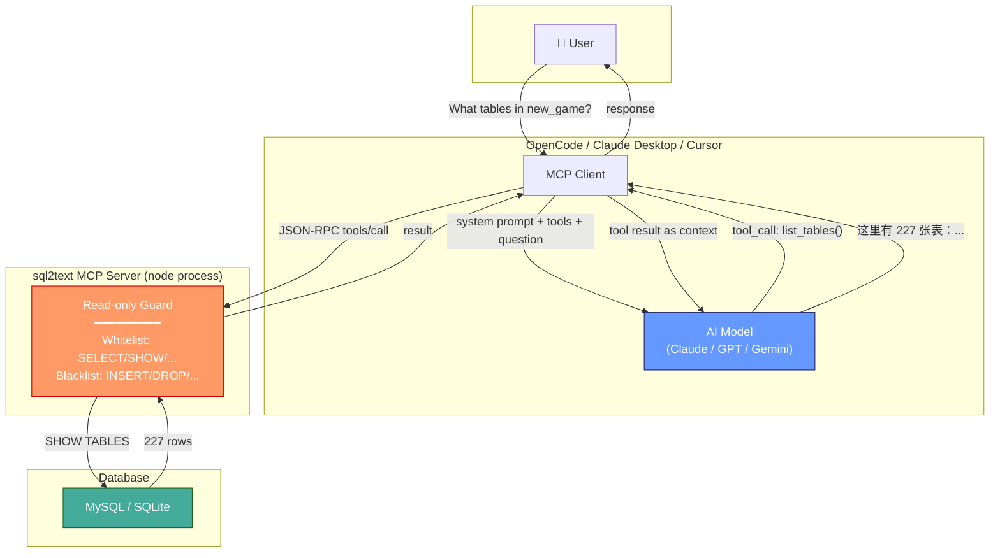
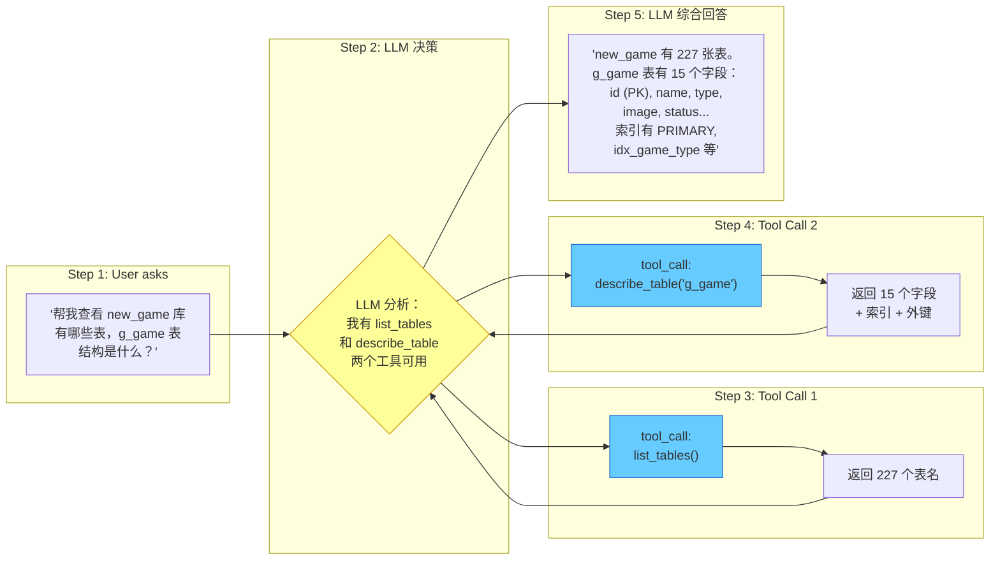

# sql2text

MCP Server providing **read-only** database access for AI coding agents (opencode, Claude Desktop, Cursor, etc.) to explore schemas, run queries, and get SQL suggestions. Zero write capability — safe for production databases.

## Features

- **Read-only by design** — SQL whitelist (SELECT/SHOW/DESCRIBE/EXPLAIN only), blacklist for DML/DDL, MySQL session-level READ ONLY, multi-statement injection guard, automatic LIMIT enforcement
- **10 MCP tools** — list databases, list tables, describe table, schema overview, sample data, query execution, EXPLAIN analysis, index/foreign key inspection, and smart query suggestions
- **Multi-driver** — MySQL, SQLite (sql.js, no native compilation needed)
- **Zero-config** — drop `config.json` with connection info, add to opencode config, done

## Quick Start

```bash
git clone <this-repo>
cd sql2text
npm install
npm run build
```

### 1. Configure database connection

```json
{
  "connections": [
    {
      "name": "my-mysql",
      "type": "mysql",
      "host": "localhost",
      "port": 3306,
      "user": "readonly_user",
      "password": "your_password",
      "database": "my_database"
    }
  ],
  "settings": {
    "defaultLimit": 100,
    "queryTimeoutMs": 30000
  }
}
```

### 2. Add to opencode / Claude Desktop / Cursor

**opencode** — add to `~/.config/opencode/opencode.json`:

```json
{
  "mcp": {
    "sql2text": {
      "type": "local",
      "command": ["node", "/path/to/sql2text/dist/index.js"],
      "environment": {
        "SQL2TEXT_CONFIG": "/path/to/sql2text/config.json"
      },
      "enabled": true
    }
  }
}
```

**Claude Desktop** — add to `claude_desktop_config.json`:

```json
{
  "mcpServers": {
    "sql2text": {
      "command": "node",
      "args": ["/path/to/sql2text/dist/index.js"],
      "env": {
        "SQL2TEXT_CONFIG": "/path/to/sql2text/config.json"
      }
    }
  }
}
```

## MCP Tools

| Tool | Description |
|---|---|
| `list_databases` | List all available databases |
| `list_tables` | List all tables in a database |
| `describe_table` | Full table structure — columns, indexes, foreign keys, row count |
| `get_schema_overview` | Complete database schema overview with all tables |
| `get_indexes` | Show indexes for a table |
| `get_foreign_keys` | Show foreign key relationships |
| `sample_data` | Preview first N rows from a table |
| `query` | Execute read-only SQL (SELECT/SHOW/DESCRIBE/EXPLAIN only) |
| `explain_query` | Analyze query execution plan |
| `suggest_query` | Get query suggestions based on table schema |

## How It Works

### Architecture Overview



### The Agentic Loop — AI Decision Process

This is the core loop that happens for every user message. The AI model iteratively decides which tools to call, receives results, and decides whether to call more tools or respond.

```mermaid
sequenceDiagram
    actor U as 👤 User
    participant OC as OpenCode<br/>(MCP Client)
    participant LLM as AI Model
    participant S2T as sql2text<br/>MCP Server
    participant DB as MySQL

    Note over S2T,DB: Startup: sql2text connects,<br/>sets READ ONLY session

    rect rgb(40, 40, 60)
        Note over OC,LLM: Tool Discovery (once at startup)
        OC->>S2T: JSON-RPC: tools/list
        S2T-->>OC: 10 tools with schemas
        OC->>LLM: Injects tools into system prompt
    end

    rect rgb(50, 40, 30)
        Note over U,DB: Runtime Agentic Loop
        U->>OC: "g_game 表有哪些索引？"

        loop Agentic Loop (may iterate multiple times)
            OC->>LLM: system prompt<br/>+ available tools<br/>+ conversation history<br/>+ user message

            alt LLM needs more info → calls tool
                LLM-->>OC: tool_call: describe_table(table="g_game")
                OC->>S2T: JSON-RPC: tools/call
                S2T->>S2T: validateSql() — pass
                S2T->>DB: SHOW FULL COLUMNS FROM g_game<br/>SHOW INDEX FROM g_game<br/>SELECT COUNT(*) FROM g_game
                DB-->>S2T: columns + indexes + count
                S2T-->>OC: structured result
                OC->>LLM: append tool_result to context
                Note over LLM: Continues loop —<br/>may call more tools

            else LLM has enough context → responds
                LLM-->>OC: final text response
                OC-->>U: "g_game 有 15 列，<br/>索引包括 PRIMARY(id),<br/>idx_game_type(type)..."
            end
        end
    end
```



### Step-by-Step: What Happens When You Ask a Question



### Key Concepts

**Tool Calling (Function Calling)** is the mechanism LLMs use to interact with external systems. Instead of generating text, the model outputs a structured JSON object specifying which tool to invoke and with what parameters. This is NOT the same as the AI "running code" — the AI only says "I want to call tool X with args Y"; the MCP Client (OpenCode) actually executes it.

**Why the loop matters**: The AI doesn't know the answer in advance. It may need multiple tool calls to gather enough context. For example, to answer "which tables have foreign keys to g_game?", the AI might first call `list_tables`, then `get_foreign_keys` on each relevant table, iterating until it has a complete picture.

**Read-only safety**: Even though the AI model decides what tools to call, the sql2text MCP Server enforces safety on the server side. If the AI were to hallucinate a `DROP TABLE` call, the readonly guard would reject it before it ever reaches the database.

## Security

- **Whitelist**: SELECT, SHOW, DESCRIBE, EXPLAIN, USE, SET, WITH (CTE)
- **Blacklist**: INSERT, UPDATE, DELETE, DROP, ALTER, CREATE, TRUNCATE, REPLACE, GRANT, REVOKE, KILL, and more
- **Session guard**: `SET SESSION TRANSACTION READ ONLY` (MySQL), `PRAGMA query_only = ON` (SQLite)
- **Multi-statement injection**: Semicolons inside string literals are ignored, multiple bare statements blocked
- **Auto LIMIT**: Every SELECT auto-appends `LIMIT` (default 100) if not present

## Story

sql2text was born from a practical need: I manage a MySQL database with 227 tables and wanted AI coding agents to help me understand and query it — without any risk of data modification. This MCP server bridges that gap, giving AI assistants structured, safe, read-only access to explore schemas, suggest queries, and help with data analysis.

## Roadmap

- [ ] Multi-connection support (query across multiple databases in one session)
- [ ] ORM code generation (TypeORM, Prisma, Drizzle, Sequelize, SQLAlchemy)
- [ ] PostgreSQL and SQL Server drivers
- [ ] ER diagram text output from foreign key relationships
- [ ] Export schema as Markdown / JSON / SQLAlchemy models

## License

MIT
